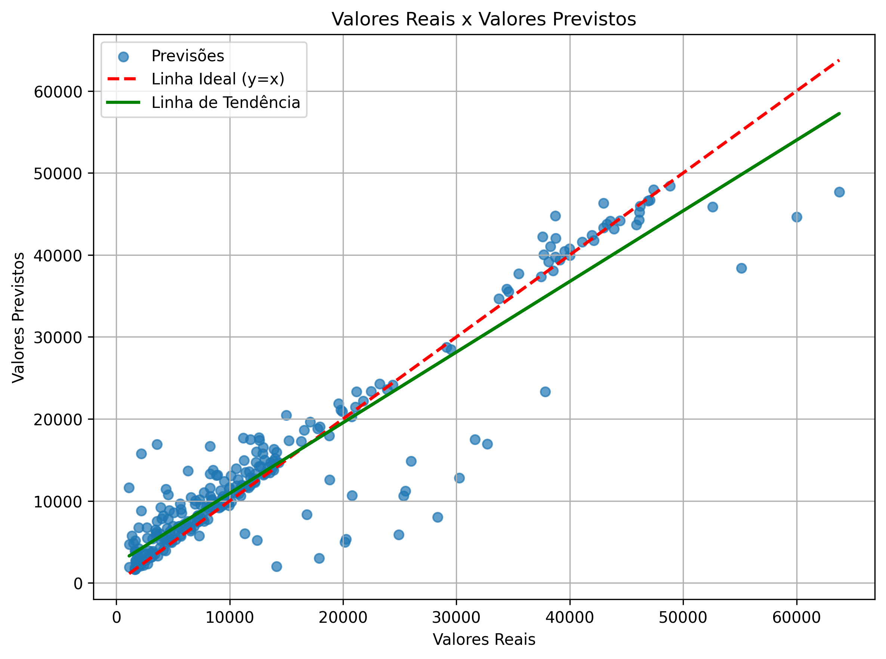
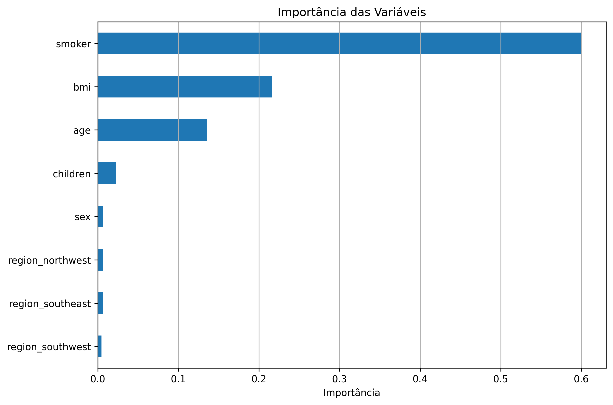
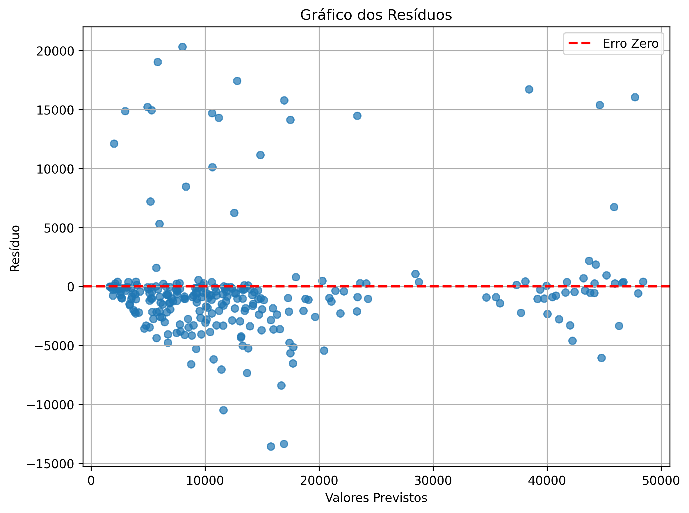
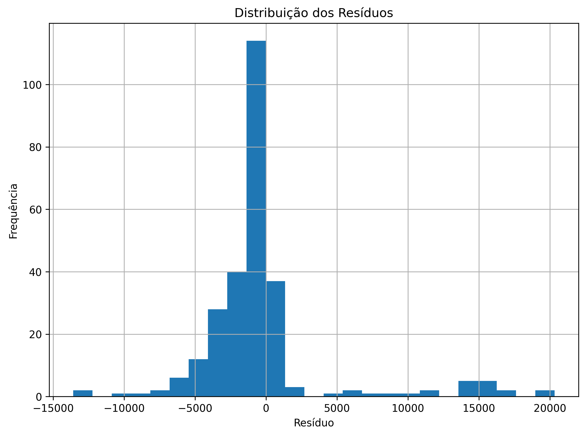

<h1 align="center">
🏥 Insurance Cost Prediction Pipeline
</h1>

<p align="center">
Pipeline completa de Machine Learning para previsão de custos de seguros de saúde utilizando Python.
</p>

<p align="center">


</p>

---
<p align="center">


</p>
# 📖 Sobre o Projeto

Este projeto implementa uma **pipeline completa de Machine Learning**, automatizando todas as etapas necessárias para construir um modelo preditivo de custos de seguros de saúde.

O objetivo é estimar o valor da variável **`charges`**, correspondente ao custo do seguro médico de um cliente, a partir de informações demográficas e clínicas presentes no conjunto de dados.

Durante a execução da pipeline são realizadas automaticamente todas as etapas do processo analítico, desde a leitura dos dados até a geração de relatórios e arquivos finais.

---

# 🎯 Problema de Negócio

Empresas do setor de seguros e saúde precisam estimar corretamente o custo esperado de cada cliente para:

- definir preços de planos;
- estimar riscos financeiros;
- apoiar decisões comerciais;
- compreender quais fatores mais influenciam os custos médicos.

Este projeto utiliza algoritmos de Machine Learning para realizar essa previsão de forma automatizada.

---

# 📊 Variável Resposta

A variável alvo utilizada foi:

```text
charges
```

Representa o valor gasto pelo cliente com o plano de saúde.

---

# 📌 Variáveis Preditoras

O modelo utiliza as seguintes variáveis:

| Variável | Descrição |
|-----------|-----------|
| age | Idade |
| sex | Sexo |
| bmi | Índice de Massa Corporal |
| children | Número de filhos |
| smoker | Indica se o cliente é fumante |
| region | Região de residência |

---

# 🏗 Arquitetura do Projeto

```text
Mini Projeto/
│
├── data/
│   ├── bronze/
│   ├── silver/
│   └── gold/
│
├── logs/
│
├── outputs/
│   ├── documents/
│   │      └── relatorio_modelo.pdf
│   │
│   └── figures/
│          ├── real_vs_previsto.png
│          ├── residuos.png
│          ├── histograma_residuos.png
│          └── importancia_variaveis.png
│
├── src/
│   ├── config.py
│   ├── ingestao.py
│   ├── exploracao.py
│   ├── tratamento.py
│   ├── preprocessamento.py
│   ├── modelagem.py
│   ├── avaliacao.py
│   ├── relatorio.py
│   ├── gold.py
│   └── main.py
│
└── requirements.txt
```

---

# ⚙️ Funcionamento da Pipeline

Toda a aplicação é executada através do arquivo:

```bash
python src/main.py
```

A execução segue o fluxo abaixo:

```text
Ingestão
      │
      ▼
Exploração dos Dados (EDA)
      │
      ▼
Tratamento
      │
      ▼
Pré-processamento
      │
      ▼
Treinamento dos Modelos
      │
      ▼
Comparação dos Modelos
      │
      ▼
Avaliação
      │
      ▼
Relatório PDF
      │
      ▼
Camada Gold
```

---

# 📂 Etapas da Pipeline

## 📥 Ingestão

Responsável por:

- localizar o dataset;
- validar sua existência;
- carregar os dados para um DataFrame;
- registrar todo o processo em log.

---

## 📈 Exploração dos Dados (EDA)

Nesta etapa são realizadas análises exploratórias como:

- dimensão da base;
- tipos das variáveis;
- valores ausentes;
- registros duplicados;
- estatísticas descritivas.

Também é gerado automaticamente:

```
outputs/documents/eda_report.txt
```

---

## 🧹 Tratamento

São realizados procedimentos de limpeza e preparação dos dados:

- remoção de duplicidades;
- padronização da base;
- geração de relatório do tratamento.

Arquivos produzidos:

```
data/silver/insurance_tratado.csv
outputs/documents/treatment_report.txt
```

---

## ⚙️ Pré-processamento

Responsável por preparar os dados para Machine Learning.

As etapas incluem:

- codificação das variáveis categóricas;
- One-Hot Encoding da variável `region`;
- separação entre Features (X) e Target (y);
- divisão treino/teste (80% / 20%).

---

## 🤖 Modelagem

São treinados dois modelos distintos:

- Linear Regression
- Random Forest Regressor

Após o treinamento ambos são avaliados automaticamente.

---

## 📊 Avaliação

São calculadas as seguintes métricas:

- MAE
- RMSE
- R²

Além disso, a pipeline gera automaticamente quatro gráficos.

---

# 📈 Resultados Visuais

## Valores Reais x Previstos

<p align="center">

</p>

---

## Resíduos

<p align="center">

</p>

---

## Distribuição dos Resíduos

<p align="center">

</p>

---

## Importância das Variáveis

<p align="center">

</p>

---

# 📄 Relatório

Ao final da execução é gerado automaticamente um relatório técnico em PDF contendo:

- descrição do problema;
- metodologia;
- métricas do modelo;
- interpretação dos resultados;
- limitações;
- conclusão.

📄 **Relatório completo**

[outputs/documents/relatorio_modelo.pdf](outputs/documents/relatorio_modelo.pdf)

---

# 🥇 Camada Gold

A camada Gold disponibiliza os resultados finais da pipeline.

São gerados automaticamente:

```text
data/gold/

model_metrics.csv
model_predictions.csv
```

---

# 📤 Arquivos Gerados

Após a execução da pipeline são produzidos automaticamente:

✅ Relatórios (.txt)

✅ Relatório em PDF

✅ Base tratada (Silver)

✅ Camada Gold

✅ Logs da execução

✅ Quatro gráficos de avaliação

---

# 📦 Tecnologias Utilizadas

- Python
- Pandas
- NumPy
- Scikit-Learn
- Matplotlib
- ReportLab
- Logging
- Pathlib

---

# ▶️ Como Executar

## Clone o repositório

```bash
git clone <url-do-repositorio>
```

---

## Instale as dependências

```bash
pip install -r requirements.txt
```

---

## Execute a aplicação

```bash
python src/main.py
```

Ao término da execução toda a estrutura de saída será gerada automaticamente.

---

# 🚀 Melhorias Futuras

- Ajuste de hiperparâmetros
- Validação Cruzada
- Pipeline do Scikit-Learn
- API REST para predições
- Interface Web
- Deploy em nuvem

---

# 👨‍💻 Autor

**Leonardo Lima**

Projeto desenvolvido como atividade prática do curso **DEVinHouse**, aplicando conceitos de Engenharia de Dados, Ciência de Dados e Machine Learning para construção de uma pipeline preditiva completa.